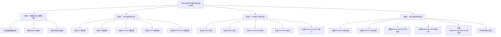

# RBAC系统ORM层代码生成任务框架

## 📋 任务概述

**任务名称**：使用AI工具生成RBAC系统的ORM层代码（Model + DAO）并测试

**任务目标**：
1. **功能目标**：生成单表的Model类与DAO接口，通过操作对象（而非SQL）实现数据库增删改查
2. **质量目标**：为每个DAO方法编写单元测试，确保CRUD操作逻辑正确，覆盖正常/异常场景

## 🎯 任务步骤框架

### 阶段1：数据库设计回顾与分析
**目标**：回顾现有RBAC系统的数据库表结构，分析表名、字段、数据类型、主键外键关系，为ORM代码生成做准备

**子任务**：
- [ ] **分析数据库表结构** - 详细分析RBAC系统中的5个核心表：users、roles、permissions、user_roles、role_permissions的字段定义、数据类型、约束条件
- [ ] **确定实体关系映射** - 分析表之间的外键关系和业务关系，确定ORM中的一对多、多对多关系映射
- [ ] **制定代码生成规范** - 制定统一的代码生成规范，包括命名约定、文件结构、注释风格等

### 阶段2：Model类代码生成
**目标**：为每个数据库表生成对应的Model类文件，包含字段映射、数据验证、序列化等功能

**子任务**：
- [ ] **生成User模型类** - 生成users表对应的User模型类，包含字段映射、数据验证、序列化方法
- [ ] **生成Role模型类** - 生成roles表对应的Role模型类，包含字段映射、数据验证、序列化方法
- [ ] **生成Permission模型类** - 生成permissions表对应的Permission模型类，包含字段映射、数据验证、序列化方法
- [ ] **生成UserRole模型类** - 生成user_roles表对应的UserRole模型类，处理用户与角色的多对多关系
- [ ] **生成RolePermission模型类** - 生成role_permissions表对应的RolePermission模型类，处理角色与权限的多对多关系

### 阶段3：DAO接口代码生成
**目标**：为每个表生成基于Model类的DAO接口文件，实现标准的CRUD操作方法

**子任务**：
- [ ] **生成UserDao接口** - 生成User模型对应的UserDao接口，实现基本的CRUD操作和用户特有的查询方法
- [ ] **生成RoleDao接口** - 生成Role模型对应的RoleDao接口，实现基本的CRUD操作和角色特有的查询方法
- [ ] **生成PermissionDao接口** - 生成Permission模型对应的PermissionDao接口，实现基本的CRUD操作和权限特有的查询方法
- [ ] **生成UserRoleDao接口** - 生成UserRole模型对应的UserRoleDao接口，实现用户角色关系的管理操作
- [ ] **生成RolePermissionDao接口** - 生成RolePermission模型对应的RolePermissionDao接口，实现角色权限关系的管理操作

### 阶段4：单元测试代码生成
**目标**：为每个DAO接口创建完整的单元测试类，覆盖正常流程和异常流程的测试用例

**子任务**：
- [ ] **创建UserDaoTest测试类** - 为UserDao接口创建完整的单元测试类，覆盖所有CRUD方法的正常和异常场景
- [ ] **创建RoleDaoTest测试类** - 为RoleDao接口创建完整的单元测试类，覆盖所有CRUD方法的正常和异常场景
- [ ] **创建PermissionDaoTest测试类** - 为PermissionDao接口创建完整的单元测试类，覆盖所有CRUD方法的正常和异常场景
- [ ] **创建UserRoleDaoTest测试类** - 为UserRoleDao接口创建完整的单元测试类，覆盖用户角色关系管理的正常和异常场景
- [ ] **创建RolePermissionDaoTest测试类** - 为RolePermissionDao接口创建完整的单元测试类，覆盖角色权限关系管理的正常和异常场景
- [ ] **执行所有单元测试** - 运行所有生成的单元测试，验证DAO接口的功能正确性，生成测试报告

## 🗂️ 项目文件分区结构

```
sql_database/
├── models/                    # ORM模型类目录
│   ├── __init__.py
│   ├── base_model.py         # 基础模型类
│   ├── user.py               # 用户模型 (User)
│   ├── role.py               # 角色模型 (Role)
│   ├── permission.py         # 权限模型 (Permission)
│   ├── user_role.py          # 用户角色关联模型 (UserRole)
│   └── role_permission.py    # 角色权限关联模型 (RolePermission)
├── dao/                      # 数据访问对象目录
│   ├── __init__.py
│   ├── base_dao.py           # 基础DAO类
│   ├── user_dao.py           # 用户DAO接口 (UserDao)
│   ├── role_dao.py           # 角色DAO接口 (RoleDao)
│   ├── permission_dao.py     # 权限DAO接口 (PermissionDao)
│   ├── user_role_dao.py      # 用户角色DAO接口 (UserRoleDao)
│   └── role_permission_dao.py # 角色权限DAO接口 (RolePermissionDao)
├── tests/                    # 单元测试目录
│   ├── __init__.py
│   ├── conftest.py           # pytest配置文件
│   ├── test_user_dao.py      # 用户DAO测试 (TestUserDao)
│   ├── test_role_dao.py      # 角色DAO测试 (TestRoleDao)
│   ├── test_permission_dao.py # 权限DAO测试 (TestPermissionDao)
│   ├── test_user_role_dao.py # 用户角色DAO测试 (TestUserRoleDao)
│   └── test_role_permission_dao.py # 角色权限DAO测试 (TestRolePermissionDao)
└── config/
    └── orm_config.py         # ORM配置文件
```

## 🗄️ 数据库表结构映射

### 核心表结构分析

| 表名 | 中文名 | 对应模型类 | 对应DAO接口 | 对应测试类 |
|------|--------|------------|-------------|------------|
| users | 用户表 | User | UserDao | TestUserDao |
| roles | 角色表 | Role | RoleDao | TestRoleDao |
| permissions | 权限表 | Permission | PermissionDao | TestPermissionDao |
| user_roles | 用户角色关联表 | UserRole | UserRoleDao | TestUserRoleDao |
| role_permissions | 角色权限关联表 | RolePermission | RolePermissionDao | TestRolePermissionDao |

### 实体关系映射

```
User (1) ←→ (N) UserRole (N) ←→ (1) Role
Role (1) ←→ (N) RolePermission (N) ←→ (1) Permission
```

**关系说明**：
- 用户与角色：多对多关系（通过user_roles表）
- 角色与权限：多对多关系（通过role_permissions表）
- 用户通过角色获得权限（间接关系）

## 📐 代码生成规范

### 命名约定
- **模型类**：PascalCase，如 `User`, `Role`, `Permission`
- **DAO类**：PascalCase + Dao后缀，如 `UserDao`, `RoleDao`
- **测试类**：Test前缀 + PascalCase，如 `TestUserDao`
- **文件名**：snake_case，如 `user.py`, `user_dao.py`, `test_user_dao.py`
- **方法名**：snake_case，如 `find_by_id`, `create_user`

### 模型类规范
每个模型类应包含：
- 字段定义和类型注解
- 数据验证方法
- 序列化/反序列化方法
- `__str__` 和 `__repr__` 方法
- 关系映射（如果有）

### DAO接口规范
每个DAO接口应包含：
- **基础CRUD操作**：
  - `create(model)` - 创建记录
  - `find_by_id(id)` - 根据ID查询
  - `find_all()` - 查询所有记录
  - `update(model)` - 更新记录
  - `delete_by_id(id)` - 根据ID删除
- **特定查询方法**：根据业务需求定义
- **批量操作方法**：`batch_create`, `batch_update`, `batch_delete`

### 测试用例规范
每个测试类应覆盖：
- **正常流程测试**：有效参数的CRUD操作、边界值测试、批量操作测试
- **异常流程测试**：无效ID测试、空值测试、重复数据测试、数据库连接异常测试

## 🛠️ 技术栈

- **ORM框架**：SQLAlchemy（Python标准ORM）
- **数据库连接**：PyMySQL + 连接池
- **测试框架**：pytest + pytest-mock
- **数据验证**：Pydantic（可选）
- **日志记录**：Python logging模块

## ✅ 质量保证

### 代码质量要求
- 代码覆盖率 ≥ 90%
- 所有方法都有完整的文档字符串
- 遵循PEP 8代码规范
- 包含完整的类型注解

### 测试质量要求
- 每个DAO方法至少3个测试用例（正常、边界、异常）
- 使用Mock对象隔离数据库依赖
- 测试数据自动清理
- 生成详细的测试报告

## 🎯 预期产出

1. **模型类文件**：5个完整的ORM模型类
2. **DAO接口文件**：5个完整的数据访问接口
3. **测试文件**：5个完整的单元测试类
4. **配置文件**：ORM和测试相关配置
5. **文档**：代码使用说明和API文档
6. **测试报告**：详细的测试执行结果

## 🏆 成功标准

- [ ] 所有模型类能正确映射数据库表结构
- [ ] 所有DAO接口能正确执行CRUD操作
- [ ] 所有单元测试通过，覆盖率达标
- [ ] 代码符合规范，文档完整
- [ ] 能通过对象操作实现数据库增删改查，无需直接编写SQL

## 📊 任务执行流程图



## 📋 详细任务清单

### 阶段1任务清单
- [ ] 1.1 分析users表结构（字段、类型、约束、索引）
- [ ] 1.2 分析roles表结构（字段、类型、约束、索引）
- [ ] 1.3 分析permissions表结构（字段、类型、约束、索引）
- [ ] 1.4 分析user_roles表结构（字段、类型、约束、索引）
- [ ] 1.5 分析role_permissions表结构（字段、类型、约束、索引）
- [ ] 1.6 确定User-Role多对多关系映射策略
- [ ] 1.7 确定Role-Permission多对多关系映射策略
- [ ] 1.8 制定Python类命名规范
- [ ] 1.9 制定文件组织结构规范
- [ ] 1.10 制定代码注释和文档规范

### 阶段2任务清单
- [ ] 2.1 创建基础模型类BaseModel
- [ ] 2.2 生成User模型类（包含字段映射、验证、序列化）
- [ ] 2.3 生成Role模型类（包含字段映射、验证、序列化）
- [ ] 2.4 生成Permission模型类（包含字段映射、验证、序列化）
- [ ] 2.5 生成UserRole关联模型类（处理多对多关系）
- [ ] 2.6 生成RolePermission关联模型类（处理多对多关系）
- [ ] 2.7 添加模型类之间的关系映射
- [ ] 2.8 为所有模型类添加完整的类型注解
- [ ] 2.9 为所有模型类添加文档字符串
- [ ] 2.10 验证模型类的正确性

### 阶段3任务清单
- [ ] 3.1 创建基础DAO类BaseDao
- [ ] 3.2 生成UserDao接口（CRUD + 特定查询方法）
- [ ] 3.3 生成RoleDao接口（CRUD + 特定查询方法）
- [ ] 3.4 生成PermissionDao接口（CRUD + 特定查询方法）
- [ ] 3.5 生成UserRoleDao接口（关系管理方法）
- [ ] 3.6 生成RolePermissionDao接口（关系管理方法）
- [ ] 3.7 为所有DAO接口添加批量操作方法
- [ ] 3.8 为所有DAO接口添加事务支持
- [ ] 3.9 为所有DAO接口添加完整的文档字符串
- [ ] 3.10 验证DAO接口的完整性

### 阶段4任务清单
- [ ] 4.1 创建pytest配置文件conftest.py
- [ ] 4.2 创建测试数据库配置
- [ ] 4.3 生成UserDaoTest测试类（正常+异常场景）
- [ ] 4.4 生成RoleDaoTest测试类（正常+异常场景）
- [ ] 4.5 生成PermissionDaoTest测试类（正常+异常场景）
- [ ] 4.6 生成UserRoleDaoTest测试类（正常+异常场景）
- [ ] 4.7 生成RolePermissionDaoTest测试类（正常+异常场景）
- [ ] 4.8 添加测试数据自动清理机制
- [ ] 4.9 执行所有单元测试并生成覆盖率报告
- [ ] 4.10 生成详细的测试执行报告

## 🔍 详细技术规范

### 数据库表字段详细分析

#### users表字段分析
```sql
CREATE TABLE users (
    id INT UNSIGNED NOT NULL AUTO_INCREMENT,           -- 主键，自增
    username VARCHAR(32) NOT NULL,                     -- 用户名，唯一
    email VARCHAR(64) NOT NULL,                        -- 邮箱，唯一
    password_hash VARCHAR(255) NOT NULL,               -- 密码哈希
    status TINYINT UNSIGNED NOT NULL DEFAULT 1,        -- 状态：1=启用，0=禁用
    created_at TIMESTAMP NOT NULL DEFAULT CURRENT_TIMESTAMP,
    updated_at TIMESTAMP NOT NULL DEFAULT CURRENT_TIMESTAMP ON UPDATE CURRENT_TIMESTAMP
);
```

#### roles表字段分析
```sql
CREATE TABLE roles (
    id SMALLINT UNSIGNED NOT NULL AUTO_INCREMENT,      -- 主键，自增
    role_name VARCHAR(32) NOT NULL,                    -- 角色名称
    role_code VARCHAR(32) NOT NULL,                    -- 角色代码，唯一
    status TINYINT UNSIGNED NOT NULL DEFAULT 1,        -- 状态：1=启用，0=禁用
    created_at TIMESTAMP NOT NULL DEFAULT CURRENT_TIMESTAMP,
    updated_at TIMESTAMP NOT NULL DEFAULT CURRENT_TIMESTAMP ON UPDATE CURRENT_TIMESTAMP
);
```

#### permissions表字段分析
```sql
CREATE TABLE permissions (
    id SMALLINT UNSIGNED NOT NULL AUTO_INCREMENT,      -- 主键，自增
    permission_name VARCHAR(64) NOT NULL,              -- 权限名称
    permission_code VARCHAR(64) NOT NULL,              -- 权限代码，唯一
    resource_type VARCHAR(32) NOT NULL,                -- 资源类型
    action_type VARCHAR(16) NOT NULL,                  -- 操作类型
    created_at TIMESTAMP NOT NULL DEFAULT CURRENT_TIMESTAMP
);
```

#### user_roles表字段分析
```sql
CREATE TABLE user_roles (
    user_id INT UNSIGNED NOT NULL,                     -- 用户ID，外键
    role_id SMALLINT UNSIGNED NOT NULL,                -- 角色ID，外键
    assigned_at TIMESTAMP NOT NULL DEFAULT CURRENT_TIMESTAMP,
    assigned_by INT UNSIGNED,                          -- 分配人ID
    status TINYINT UNSIGNED NOT NULL DEFAULT 1         -- 状态：1=启用，0=禁用
);
```

#### role_permissions表字段分析
```sql
CREATE TABLE role_permissions (
    role_id SMALLINT UNSIGNED NOT NULL,                -- 角色ID，外键
    permission_id SMALLINT UNSIGNED NOT NULL,          -- 权限ID，外键
    granted_at TIMESTAMP NOT NULL DEFAULT CURRENT_TIMESTAMP,
    granted_by INT UNSIGNED,                           -- 授权人ID
    status TINYINT UNSIGNED NOT NULL DEFAULT 1         -- 状态：1=启用，0=禁用
);
```

## 📝 代码模板示例

### 模型类模板示例
```python
from datetime import datetime
from typing import Optional
from sqlalchemy import Column, Integer, String, DateTime, Boolean
from sqlalchemy.ext.declarative import declarative_base

Base = declarative_base()

class User(Base):
    """用户模型类"""
    __tablename__ = 'users'

    id: int = Column(Integer, primary_key=True, autoincrement=True)
    username: str = Column(String(32), nullable=False, unique=True)
    email: str = Column(String(64), nullable=False, unique=True)
    password_hash: str = Column(String(255), nullable=False)
    status: int = Column(Integer, nullable=False, default=1)
    created_at: datetime = Column(DateTime, nullable=False, default=datetime.utcnow)
    updated_at: datetime = Column(DateTime, nullable=False, default=datetime.utcnow, onupdate=datetime.utcnow)

    def __str__(self) -> str:
        return f"User(id={self.id}, username='{self.username}')"

    def __repr__(self) -> str:
        return self.__str__()
```

### DAO接口模板示例
```python
from typing import List, Optional
from abc import ABC, abstractmethod
from models.user import User

class UserDao(ABC):
    """用户数据访问对象接口"""

    @abstractmethod
    def create(self, user: User) -> User:
        """创建用户"""
        pass

    @abstractmethod
    def find_by_id(self, user_id: int) -> Optional[User]:
        """根据ID查找用户"""
        pass

    @abstractmethod
    def find_all(self) -> List[User]:
        """查找所有用户"""
        pass

    @abstractmethod
    def update(self, user: User) -> User:
        """更新用户"""
        pass

    @abstractmethod
    def delete_by_id(self, user_id: int) -> bool:
        """根据ID删除用户"""
        pass
```

### 测试类模板示例
```python
import pytest
from unittest.mock import Mock, patch
from dao.user_dao import UserDao
from models.user import User

class TestUserDao:
    """用户DAO测试类"""

    @pytest.fixture
    def user_dao(self):
        """创建UserDao实例"""
        return Mock(spec=UserDao)

    @pytest.fixture
    def sample_user(self):
        """创建示例用户"""
        return User(
            id=1,
            username="testuser",
            email="test@example.com",
            password_hash="hashed_password",
            status=1
        )

    def test_create_user_success(self, user_dao, sample_user):
        """测试创建用户成功"""
        user_dao.create.return_value = sample_user
        result = user_dao.create(sample_user)
        assert result.username == "testuser"
        user_dao.create.assert_called_once_with(sample_user)

    def test_find_by_id_success(self, user_dao, sample_user):
        """测试根据ID查找用户成功"""
        user_dao.find_by_id.return_value = sample_user
        result = user_dao.find_by_id(1)
        assert result is not None
        assert result.id == 1
        user_dao.find_by_id.assert_called_once_with(1)

    def test_find_by_id_not_found(self, user_dao):
        """测试根据ID查找用户不存在"""
        user_dao.find_by_id.return_value = None
        result = user_dao.find_by_id(999)
        assert result is None
        user_dao.find_by_id.assert_called_once_with(999)
```

## 🚀 任务执行提示词方案

### 阶段1提示词：数据库设计回顾与分析

#### 1.1 分析数据库表结构提示词
```
任务：分析RBAC系统数据库表结构，为ORM代码生成做准备

执行要求：
1. 详细分析以下5个核心表的结构：
   - users表：用户基本信息表
   - roles表：角色定义表
   - permissions表：权限定义表
   - user_roles表：用户角色关联表
   - role_permissions表：角色权限关联表

2. 对每个表分析以下内容：
   - 字段名称、数据类型、长度限制
   - 主键、外键、唯一约束
   - 索引设计和性能考虑
   - 默认值和自动更新规则

3. 输出格式：
   - 创建表结构分析文档
   - 生成字段映射清单
   - 标注关键约束条件

参考文件：
- sql/01_basic_rbac_schema.sql
- sql/02_optimized_schema.sql
- docs/01_database_design.md

输出文件：docs/table_structure_analysis.md
```

#### 1.2 确定实体关系映射提示词
```
任务：确定RBAC系统中实体间的关系映射策略

执行要求：
1. 分析表间关系：
   - User ↔ Role：多对多关系（通过user_roles表）
   - Role ↔ Permission：多对多关系（通过role_permissions表）
   - 识别级联删除和更新规则

2. 设计ORM关系映射：
   - 确定SQLAlchemy关系映射策略
   - 设计反向引用(back_populates)
   - 处理关联表的额外字段（如assigned_at, status等）

3. 制定关系查询策略：
   - 懒加载vs急加载策略
   - 关联查询优化方案
   - 避免N+1查询问题

输出内容：
- 实体关系图(ERD)
- SQLAlchemy关系映射配置
- 查询优化建议

输出文件：docs/entity_relationship_mapping.md
```

#### 1.3 制定代码生成规范提示词
```
任务：制定统一的ORM代码生成规范和标准

执行要求：
1. 命名规范制定：
   - 类名：PascalCase（如User, UserRole）
   - 方法名：snake_case（如find_by_id, create_user）
   - 文件名：snake_case（如user.py, user_dao.py）
   - 常量名：UPPER_SNAKE_CASE

2. 代码结构规范：
   - 模型类必须包含的方法和属性
   - DAO接口必须实现的标准方法
   - 测试类的组织结构和命名

3. 文档和注释规范：
   - 类和方法的docstring格式
   - 类型注解要求
   - 代码注释风格

4. 质量标准：
   - 代码覆盖率要求（≥90%）
   - PEP 8规范遵循
   - 错误处理标准

输出内容：
- 完整的编码规范文档
- 代码模板示例
- 质量检查清单

输出文件：docs/coding_standards.md
```

### 阶段2提示词：Model类代码生成

#### 2.1 生成基础模型类提示词
```
任务：创建SQLAlchemy基础模型类，为所有实体模型提供通用功能

执行要求：
1. 创建BaseModel基类：
   - 包含通用字段（id, created_at, updated_at）
   - 提供通用方法（to_dict, from_dict, __str__, __repr__）
   - 实现数据验证基础框架
   - 添加序列化/反序列化支持

2. 技术实现：
   - 使用SQLAlchemy declarative_base
   - 添加完整的类型注解
   - 实现抽象方法定义
   - 提供扩展接口

3. 代码质量：
   - 完整的docstring文档
   - 异常处理机制
   - 单元测试覆盖

输出文件：models/base_model.py
```

#### 2.2 生成User模型类提示词
```
任务：生成users表对应的User模型类

执行要求：
1. 字段映射：
   - id: int (主键，自增)
   - username: str (唯一，非空，长度32)
   - email: str (唯一，非空，长度64)
   - password_hash: str (非空，长度255)
   - status: int (默认1，表示启用状态)
   - created_at, updated_at: datetime (自动维护)

2. 业务方法：
   - validate_email(): 邮箱格式验证
   - validate_username(): 用户名格式验证
   - is_active(): 检查用户是否启用
   - set_password(): 密码设置（配合密码哈希）
   - check_password(): 密码验证

3. 关系映射：
   - 与UserRole的一对多关系
   - 通过角色获取权限的便捷方法

4. 序列化支持：
   - to_dict(): 转换为字典（排除敏感信息）
   - from_dict(): 从字典创建实例
   - to_json(): JSON序列化

输出文件：models/user.py
```

#### 2.3 生成Role模型类提示词
```
任务：生成roles表对应的Role模型类

执行要求：
1. 字段映射：
   - id: int (主键，自增)
   - role_name: str (非空，长度32)
   - role_code: str (唯一，非空，长度32)
   - status: int (默认1，表示启用状态)
   - created_at, updated_at: datetime (自动维护)

2. 业务方法：
   - validate_role_code(): 角色代码格式验证
   - is_active(): 检查角色是否启用
   - get_permissions(): 获取角色的所有权限
   - has_permission(): 检查是否具有特定权限

3. 关系映射：
   - 与UserRole的一对多关系
   - 与RolePermission的一对多关系

4. 序列化支持：
   - to_dict(): 转换为字典
   - from_dict(): 从字典创建实例
   - to_json(): JSON序列化

输出文件：models/role.py
```

#### 2.4 生成Permission模型类提示词
```
任务：生成permissions表对应的Permission模型类

执行要求：
1. 字段映射：
   - id: int (主键，自增)
   - permission_name: str (非空，长度64)
   - permission_code: str (唯一，非空，长度64)
   - resource_type: str (非空，长度32)
   - action_type: str (非空，长度16)
   - created_at: datetime (自动维护)

2. 业务方法：
   - validate_permission_code(): 权限代码格式验证
   - get_full_permission(): 获取完整权限描述
   - matches_resource_action(): 匹配资源和操作类型

3. 关系映射：
   - 与RolePermission的一对多关系

4. 序列化支持：
   - to_dict(): 转换为字典
   - from_dict(): 从字典创建实例
   - to_json(): JSON序列化

输出文件：models/permission.py
```

#### 2.5 生成UserRole模型类提示词
```
任务：生成user_roles表对应的UserRole关联模型类

执行要求：
1. 字段映射：
   - user_id: int (外键，关联users.id)
   - role_id: int (外键，关联roles.id)
   - assigned_at: datetime (分配时间)
   - assigned_by: int (分配人ID，可选)
   - status: int (默认1，表示启用状态)

2. 关系映射：
   - 与User的多对一关系
   - 与Role的多对一关系
   - 与分配人User的多对一关系

3. 业务方法：
   - is_active(): 检查关联是否启用
   - activate(): 启用关联
   - deactivate(): 禁用关联

4. 复合主键：
   - 使用(user_id, role_id)作为复合主键

输出文件：models/user_role.py
```

#### 2.6 生成RolePermission模型类提示词
```
任务：生成role_permissions表对应的RolePermission关联模型类

执行要求：
1. 字段映射：
   - role_id: int (外键，关联roles.id)
   - permission_id: int (外键，关联permissions.id)
   - granted_at: datetime (授权时间)
   - granted_by: int (授权人ID，可选)
   - status: int (默认1，表示启用状态)

2. 关系映射：
   - 与Role的多对一关系
   - 与Permission的多对一关系
   - 与授权人User的多对一关系

3. 业务方法：
   - is_active(): 检查关联是否启用
   - activate(): 启用关联
   - deactivate(): 禁用关联

4. 复合主键：
   - 使用(role_id, permission_id)作为复合主键

输出文件：models/role_permission.py
```

### 阶段3提示词：DAO接口代码生成

#### 3.1 生成基础DAO类提示词
```
任务：创建基础DAO抽象类，定义通用的数据访问接口

执行要求：
1. 创建BaseDao抽象类：
   - 定义标准CRUD操作接口
   - 提供数据库连接管理
   - 实现事务支持
   - 添加批量操作接口

2. 标准方法定义：
   - create(model): 创建单个记录
   - find_by_id(id): 根据ID查询
   - find_all(): 查询所有记录
   - update(model): 更新记录
   - delete_by_id(id): 删除记录
   - batch_create(models): 批量创建
   - batch_update(models): 批量更新
   - batch_delete(ids): 批量删除

3. 技术实现：
   - 使用SQLAlchemy Session管理
   - 实现连接池支持
   - 添加异常处理机制
   - 提供日志记录功能

输出文件：dao/base_dao.py
```

#### 3.2 生成UserDao接口提示词
```
任务：生成User模型对应的UserDao数据访问接口

执行要求：
1. 继承BaseDao，实现标准CRUD操作

2. 用户特有查询方法：
   - find_by_username(username): 根据用户名查询
   - find_by_email(email): 根据邮箱查询
   - find_active_users(): 查询所有启用用户
   - find_by_status(status): 根据状态查询
   - search_users(keyword): 用户搜索（用户名或邮箱）

3. 用户角色相关方法：
   - get_user_roles(user_id): 获取用户的所有角色
   - get_user_permissions(user_id): 获取用户的所有权限
   - has_role(user_id, role_code): 检查用户是否具有特定角色
   - has_permission(user_id, permission_code): 检查用户是否具有特定权限

4. 用户管理方法：
   - activate_user(user_id): 启用用户
   - deactivate_user(user_id): 禁用用户
   - update_password(user_id, password_hash): 更新密码
   - update_last_login(user_id): 更新最后登录时间

输出文件：dao/user_dao.py
```

#### 3.3 生成RoleDao接口提示词
```
任务：生成Role模型对应的RoleDao数据访问接口

执行要求：
1. 继承BaseDao，实现标准CRUD操作

2. 角色特有查询方法：
   - find_by_role_code(role_code): 根据角色代码查询
   - find_active_roles(): 查询所有启用角色
   - find_by_status(status): 根据状态查询
   - search_roles(keyword): 角色搜索

3. 角色权限相关方法：
   - get_role_permissions(role_id): 获取角色的所有权限
   - has_permission(role_id, permission_code): 检查角色是否具有特定权限
   - get_role_users(role_id): 获取拥有该角色的所有用户

4. 角色管理方法：
   - activate_role(role_id): 启用角色
   - deactivate_role(role_id): 禁用角色

输出文件：dao/role_dao.py
```

#### 3.4 生成PermissionDao接口提示词
```
任务：生成Permission模型对应的PermissionDao数据访问接口

执行要求：
1. 继承BaseDao，实现标准CRUD操作

2. 权限特有查询方法：
   - find_by_permission_code(permission_code): 根据权限代码查询
   - find_by_resource_type(resource_type): 根据资源类型查询
   - find_by_action_type(action_type): 根据操作类型查询
   - find_by_resource_action(resource_type, action_type): 根据资源和操作查询
   - search_permissions(keyword): 权限搜索

3. 权限关系相关方法：
   - get_permission_roles(permission_id): 获取拥有该权限的所有角色
   - get_permission_users(permission_id): 获取拥有该权限的所有用户（通过角色）

4. 权限分组方法：
   - get_permissions_by_resource(): 按资源类型分组获取权限
   - get_resource_types(): 获取所有资源类型
   - get_action_types(): 获取所有操作类型

输出文件：dao/permission_dao.py
```

#### 3.5 生成UserRoleDao接口提示词
```
任务：生成UserRole关联模型对应的UserRoleDao数据访问接口

执行要求：
1. 用户角色关系管理：
   - assign_role(user_id, role_id, assigned_by): 分配角色给用户
   - revoke_role(user_id, role_id): 撤销用户角色
   - reassign_role(user_id, old_role_id, new_role_id): 重新分配角色

2. 查询方法：
   - find_by_user_id(user_id): 查询用户的所有角色关联
   - find_by_role_id(role_id): 查询角色的所有用户关联
   - find_active_assignments(): 查询所有启用的关联
   - find_by_assigned_by(assigned_by): 查询某人分配的所有关联

3. 批量操作：
   - batch_assign_roles(user_id, role_ids): 批量分配角色
   - batch_revoke_roles(user_id, role_ids): 批量撤销角色
   - batch_assign_users(role_id, user_ids): 批量分配用户

4. 状态管理：
   - activate_assignment(user_id, role_id): 启用关联
   - deactivate_assignment(user_id, role_id): 禁用关联

输出文件：dao/user_role_dao.py
```

#### 3.6 生成RolePermissionDao接口提示词
```
任务：生成RolePermission关联模型对应的RolePermissionDao数据访问接口

执行要求：
1. 角色权限关系管理：
   - grant_permission(role_id, permission_id, granted_by): 授予权限给角色
   - revoke_permission(role_id, permission_id): 撤销角色权限
   - regrant_permission(role_id, old_permission_id, new_permission_id): 重新授权

2. 查询方法：
   - find_by_role_id(role_id): 查询角色的所有权限关联
   - find_by_permission_id(permission_id): 查询权限的所有角色关联
   - find_active_grants(): 查询所有启用的关联
   - find_by_granted_by(granted_by): 查询某人授权的所有关联

3. 批量操作：
   - batch_grant_permissions(role_id, permission_ids): 批量授予权限
   - batch_revoke_permissions(role_id, permission_ids): 批量撤销权限
   - batch_grant_roles(permission_id, role_ids): 批量授权角色

4. 状态管理：
   - activate_grant(role_id, permission_id): 启用关联
   - deactivate_grant(role_id, permission_id): 禁用关联

输出文件：dao/role_permission_dao.py
```

### 阶段4提示词：单元测试代码生成

#### 4.1 创建测试配置提示词
```
任务：创建pytest测试配置和测试环境设置

执行要求：
1. 创建conftest.py配置文件：
   - 配置测试数据库连接
   - 创建测试用的SQLAlchemy引擎和会话
   - 设置测试数据的自动清理机制
   - 提供通用的测试夹具(fixtures)

2. 测试数据库配置：
   - 使用内存SQLite数据库进行测试
   - 自动创建和销毁测试表结构
   - 提供测试数据的隔离机制

3. 通用测试夹具：
   - db_session: 数据库会话夹具
   - sample_data: 测试数据夹具
   - mock_dao: DAO对象模拟夹具

输出文件：tests/conftest.py
```

#### 4.2 生成UserDaoTest测试类提示词
```
任务：为UserDao接口创建完整的单元测试类

执行要求：
1. 基础CRUD操作测试：
   - test_create_user_success(): 测试创建用户成功
   - test_create_user_duplicate_username(): 测试用户名重复异常
   - test_create_user_duplicate_email(): 测试邮箱重复异常
   - test_find_by_id_success(): 测试根据ID查询成功
   - test_find_by_id_not_found(): 测试查询不存在的用户
   - test_find_all_success(): 测试查询所有用户
   - test_update_user_success(): 测试更新用户成功
   - test_update_user_not_found(): 测试更新不存在的用户
   - test_delete_by_id_success(): 测试删除用户成功
   - test_delete_by_id_not_found(): 测试删除不存在的用户

2. 用户特有方法测试：
   - test_find_by_username_success(): 测试根据用户名查询
   - test_find_by_email_success(): 测试根据邮箱查询
   - test_find_active_users(): 测试查询启用用户
   - test_search_users(): 测试用户搜索功能

3. 用户角色权限测试：
   - test_get_user_roles(): 测试获取用户角色
   - test_get_user_permissions(): 测试获取用户权限
   - test_has_role(): 测试检查用户角色
   - test_has_permission(): 测试检查用户权限

4. 异常场景测试：
   - test_create_user_invalid_data(): 测试无效数据
   - test_operations_with_null_values(): 测试空值处理
   - test_database_connection_error(): 测试数据库连接异常

输出文件：tests/test_user_dao.py
```

#### 4.3 生成RoleDaoTest测试类提示词
```
任务：为RoleDao接口创建完整的单元测试类

执行要求：
1. 基础CRUD操作测试：
   - test_create_role_success(): 测试创建角色成功
   - test_create_role_duplicate_code(): 测试角色代码重复异常
   - test_find_by_id_success(): 测试根据ID查询成功
   - test_find_by_id_not_found(): 测试查询不存在的角色
   - test_find_all_success(): 测试查询所有角色
   - test_update_role_success(): 测试更新角色成功
   - test_delete_by_id_success(): 测试删除角色成功

2. 角色特有方法测试：
   - test_find_by_role_code_success(): 测试根据角色代码查询
   - test_find_active_roles(): 测试查询启用角色
   - test_search_roles(): 测试角色搜索功能

3. 角色权限关系测试：
   - test_get_role_permissions(): 测试获取角色权限
   - test_has_permission(): 测试检查角色权限
   - test_get_role_users(): 测试获取角色用户

4. 状态管理测试：
   - test_activate_role(): 测试启用角色
   - test_deactivate_role(): 测试禁用角色

5. 异常场景测试：
   - test_create_role_invalid_data(): 测试无效数据
   - test_operations_with_null_values(): 测试空值处理

输出文件：tests/test_role_dao.py
```

#### 4.4 生成PermissionDaoTest测试类提示词
```
任务：为PermissionDao接口创建完整的单元测试类

执行要求：
1. 基础CRUD操作测试：
   - test_create_permission_success(): 测试创建权限成功
   - test_create_permission_duplicate_code(): 测试权限代码重复异常
   - test_find_by_id_success(): 测试根据ID查询成功
   - test_find_all_success(): 测试查询所有权限
   - test_update_permission_success(): 测试更新权限成功
   - test_delete_by_id_success(): 测试删除权限成功

2. 权限特有方法测试：
   - test_find_by_permission_code(): 测试根据权限代码查询
   - test_find_by_resource_type(): 测试根据资源类型查询
   - test_find_by_action_type(): 测试根据操作类型查询
   - test_find_by_resource_action(): 测试根据资源和操作查询
   - test_search_permissions(): 测试权限搜索功能

3. 权限关系测试：
   - test_get_permission_roles(): 测试获取权限的角色
   - test_get_permission_users(): 测试获取权限的用户

4. 权限分组测试：
   - test_get_permissions_by_resource(): 测试按资源分组
   - test_get_resource_types(): 测试获取资源类型
   - test_get_action_types(): 测试获取操作类型

5. 异常场景测试：
   - test_create_permission_invalid_data(): 测试无效数据
   - test_operations_with_null_values(): 测试空值处理

输出文件：tests/test_permission_dao.py
```

#### 4.5 生成UserRoleDaoTest测试类提示词
```
任务：为UserRoleDao接口创建完整的单元测试类

执行要求：
1. 用户角色关系管理测试：
   - test_assign_role_success(): 测试分配角色成功
   - test_assign_role_duplicate(): 测试重复分配角色
   - test_revoke_role_success(): 测试撤销角色成功
   - test_revoke_role_not_found(): 测试撤销不存在的关联
   - test_reassign_role_success(): 测试重新分配角色

2. 查询方法测试：
   - test_find_by_user_id(): 测试查询用户的角色关联
   - test_find_by_role_id(): 测试查询角色的用户关联
   - test_find_active_assignments(): 测试查询启用的关联
   - test_find_by_assigned_by(): 测试查询分配人的关联

3. 批量操作测试：
   - test_batch_assign_roles(): 测试批量分配角色
   - test_batch_revoke_roles(): 测试批量撤销角色
   - test_batch_assign_users(): 测试批量分配用户

4. 状态管理测试：
   - test_activate_assignment(): 测试启用关联
   - test_deactivate_assignment(): 测试禁用关联

5. 异常场景测试：
   - test_assign_role_invalid_user(): 测试无效用户ID
   - test_assign_role_invalid_role(): 测试无效角色ID
   - test_operations_with_null_values(): 测试空值处理

输出文件：tests/test_user_role_dao.py
```

#### 4.6 生成RolePermissionDaoTest测试类提示词
```
任务：为RolePermissionDao接口创建完整的单元测试类

执行要求：
1. 角色权限关系管理测试：
   - test_grant_permission_success(): 测试授予权限成功
   - test_grant_permission_duplicate(): 测试重复授予权限
   - test_revoke_permission_success(): 测试撤销权限成功
   - test_revoke_permission_not_found(): 测试撤销不存在的关联
   - test_regrant_permission_success(): 测试重新授权

2. 查询方法测试：
   - test_find_by_role_id(): 测试查询角色的权限关联
   - test_find_by_permission_id(): 测试查询权限的角色关联
   - test_find_active_grants(): 测试查询启用的关联
   - test_find_by_granted_by(): 测试查询授权人的关联

3. 批量操作测试：
   - test_batch_grant_permissions(): 测试批量授予权限
   - test_batch_revoke_permissions(): 测试批量撤销权限
   - test_batch_grant_roles(): 测试批量授权角色

4. 状态管理测试：
   - test_activate_grant(): 测试启用关联
   - test_deactivate_grant(): 测试禁用关联

5. 异常场景测试：
   - test_grant_permission_invalid_role(): 测试无效角色ID
   - test_grant_permission_invalid_permission(): 测试无效权限ID
   - test_operations_with_null_values(): 测试空值处理

输出文件：tests/test_role_permission_dao.py
```

#### 4.7 执行测试和生成报告提示词
```
任务：执行所有单元测试并生成详细的测试报告

执行要求：
1. 测试执行：
   - 运行所有测试用例
   - 生成代码覆盖率报告
   - 记录测试执行时间
   - 捕获测试失败详情

2. 报告生成：
   - HTML格式的覆盖率报告
   - 详细的测试结果报告
   - 性能测试报告
   - 测试质量分析报告

3. 质量检查：
   - 确保代码覆盖率≥90%
   - 验证所有测试用例通过
   - 检查测试代码质量
   - 生成改进建议

4. 执行命令：
   ```bash
   # 运行所有测试
   pytest tests/ -v --cov=models --cov=dao --cov-report=html

   # 生成详细报告
   pytest tests/ --html=reports/test_report.html --self-contained-html
   ```

输出文件：
- reports/htmlcov/index.html (覆盖率报告)
- reports/test_report.html (测试结果报告)
- reports/test_summary.md (测试总结文档)
```

## 📋 提示词使用指南

### 使用方式
1. **按阶段执行**：严格按照阶段1→2→3→4的顺序执行
2. **逐个任务**：每个阶段内按照子任务顺序逐一完成
3. **质量检查**：每完成一个子任务都要进行代码质量检查
4. **文档更新**：及时更新相关文档和进度记录

### 注意事项
- 每个提示词都包含了具体的执行要求和输出文件
- 严格遵循代码规范和命名约定
- 确保所有代码都有完整的文档字符串和类型注解
- 测试用例要覆盖正常流程和异常流程
- 及时处理依赖关系和导入问题

### 质量标准
- 代码覆盖率必须≥90%
- 所有测试用例必须通过
- 遵循PEP 8代码规范
- 完整的错误处理和日志记录
- 清晰的文档和注释

---

**任务创建时间**：2025-07-19
**预计完成时间**：根据实际执行情况调整
**负责人**：AI助手 + 用户协作
**文档版本**：v1.0
